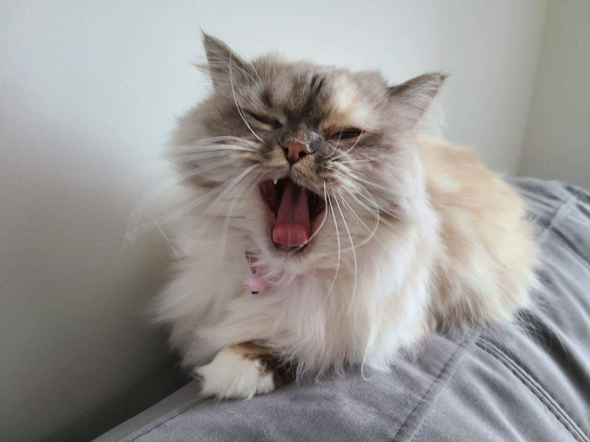

# Alt-text generator for images
## Abstract
Our project uses concepts of a CNN and LSTM model to build a working model of an alt-text (alt-text can be defined as a descriptive caption about each scene in a video or an image) generator by implementing CNN with LSTM. We do so by first extracting the image features from an example dataset to be trained on. We use the pre-trained model, Xception, which is a CNN model trained on the imagenet dataset to perform feature extraction. Convolutional Neural Networks (CNN) are specialized deep neural networks which can process data with 2D matrix shapes, which makes images easily representable with CNN and very useful when working with image classification and image identification purposes. CNN scans images from left to right and top to bottom to pull out important features from the image and combines the features to classify images. This is especially useful in our case, as it means that our alt-text generator can also handle images that have been translated, rotated, scaled and changed in perspective.

Once our features are extracted, we then feed our features into the LSTM model which generates the alt-text for our images. Long Short Term Memory (LSTM) is a type of Recurrent Neural Network (RNN) that works best for sequence prediction problems. This means that it is able to predict what the next word in a sequence would be based on the preceding text. LSTM is useful to our project because it will use the information from CNN to help generate a description of the image based on the extracted features, after learning patterns from the provided image captions. After creating a working alt-text generator, we create a front-end website in which users can upload their own images, and generate alt-text (descriptive captions) for their own photos, which greatly aids users with visual-impairments to be able to understand the contents of their images.

## Problem statement
We want to solve the problem with accessibility of communicating digital media for people with visual impairments, and how they may not be able to visually experience pictures and images without alt-text. Many images and video frames on the Internet (and in general media) do not always have alt-text inscribed, so we will be building a program that will take in any photo and automatically generate alt-text for the image / video frame that describes what is in the picture.

## Datasets
For the alt-text generator that we are using, we trained our models on the [Flickr_8K dataset](https://www.kaggle.com/datasets/adityajn105/flickr8k), which is a dataset that provides 8 thousand images along with their respective human-labeled and human-generated alt-texts. We also found other larger datasets such as the [Flickr_30K dataset](https://www.kaggle.com/datasets/hsankesara/flickr-image-dataset), however, we realized halfway through simply extracting the features of the dataset that it would not be feasible to use a dataset to this size for the timeframe of our project as it was taking days for feature extraction and an estimated weeks just to train the network on the dataset. For this reason, we chose to use the smaller Flickr_8K dataset. However, there is still the advantage of using a much larger dataset which is that we can build more accurate and better performing models. Using a larger dataset is perhaps one area of improvement for future work on an alt-text generator, if we had more than 2 weeks to finish the project.

## Other References
- [Xception: Deep Learning with Depthwise Separable Convolutions](https://arxiv.org/abs/1610.02357)
- [Automatic Image Captioning Using Deep Learning](https://medium.com/swlh/automatic-image-captioning-using-deep-learning-5e899c127387)
- [Image Captioning With Flickr8k Dataset & BLEU](https://medium.com/@raman.shinde15/image-captioning-with-flickr8k-dataset-bleu-4bcba0b52926)

## Methodology
Our alt-text generator will involve components of both computer vision and natural language processing to recognize the context of an image and describe them coherently in English. Below is the architecture for our final model:

### 1. Data cleaning

To build our model, first we had to load and pre-process our Flicker_8k dataset. Within the dataset, each image has 5 captions and a number from 0 to 4 is assigned for each caption. We created a function that would create a dictionary of descriptions that maps each image in the dataset to a list of its respective 5 captions. After we have preprocessed all the descriptions, we save them and store them in a file linked to each image for easy reference. 

### 2. Extracting feature vector from images

To extract the features of the images, we used the pre-trained Xception model. This model has already been trained on the large imagenet dataset and is able to extract features from our images based on 1000 different classes that will be used to classify our imputed Flickr_8k dataset. We directly import this model from the keras.applications.xception package. Since the Xception model was originally built for the imagenet dataset, we had to perform little changes to make our dataset compatible with the model, such as adapting to the 299x299x3 image size input that the model takes in, as well removing the last classification layer to retrieve the 2048 feature vector. Using the extract_features() function, we extract the features for all the images and map the image file names with their respective feature array, and finally we dump the features into a features.p file for later reference. 

### 3. Training on dataset

First we load the file with the preprocessed descriptions linked to the images and return the list of images. Then we create a dictionary that contains the captions for each photo from the current file with the list of all the images. We also append some sort of starting and ending identifier for each caption, so that our LSTM model will be able to identify the start and end of each of the captions. Finally, we create the dictionary for image names linked with their respective feature vector which was previously extracted using the Xception model. 

### 4. Tokenizing vocabulary

In order to make the natural English captions understandable for the model, we create a numeric representation of them. We do this by mapping each word of the vocabulary with a unique index value. We use the keras library to import a tokenizer function that creates tokens based on the vocabulary and saves them to a tokenizer.p pickle file. We also calculate the maximum length of the descriptions in order to help us decide the structure of the model’s parameters when used later on. In our case, we found the maximum length of the descriptions to be 32. 

### 5. Creating data generator

We create a supervised learning task where we have to train our model on 8000 images and each image contains a feature vector of length 2048 with captions represented numerically. Since we do not possess the memory to store so much data for 8000 images each, we use a generator that will yield data in batches. The data generator yields the input and output sequence. So for example, if the input to our model was [x1, x2] and the output was y, then x1 represents the 2048 feature vector of that particular image, x2 represents the input text sequence, and y represents the output text sequence that the model predicts. 

### 6. Defining CNN-RNN model

We use the Keras Model from the Functional API to create the structure of the model. There are three major components to the model structure. (1) The feature extractor, which extracts features of size 2048 from the image, and with a dense layer reduces the dimensions to 256 nodes. (2) The sequence processor which is an embedding layer that handles the text input followed by the LSTM layer. (3) The decoder, which works by merging the output from its above two layers and processes by the dense layer to make the final prediction. The final layer will contain the same number of nodes as the vocabulary size of the dataset. The model structure can be visualized below. 

### 7. Training model

In training the model, we use the 8000 images in the training dataset by generating the input and output sequences in batches and fitting them to the model using the keras model.fit_generator() function. Finally, we save the model to our models folder after every epoch of training. 

### 8. Testing model

After the model has been trained, we load the model and generate predictions based on a testing dataset (or inputted images of our own). The predictions contain the max length of index values so we use the tokenizer.p file we dumped our extracted features into to get the words from their index values.

## Experiments/evaluation & Results
We iteratively improved upon the vanilla model that we have and demonstrated that using a deeper network, pre-trained ImageNet weights and text embeddings did improve the performance of the model significantly. To evaluate the performance of the model, we evaluated the cumulative n-gram BLEU scores on 1000 test images on the dataset, including monogram, bigram, trigram, and 4-gram. We also generated plots for BLEU scores for each of the 10 epochs we trained for each version of the model.

### Experiment 1
We first evaluated a simple model with the following architecture, which involves only one LSTM layer and a single dense layer on the image input:

The result has very low BLEU scores across the 10 epochs, with the overall highest scores at epoch 5 being:

- Bleu_Score -1 = 0.17166666666666666
- Bleu_Score -2 = 0.09524447709272524
- Bleu_Score -3 = 0.052946327762524635
- Bleu_Score -4 = 0.0258724441158954

### Experiment 2
We then increased the complexity of the model by adding one more LSTM layer and an extra dense layer for the image input:

The result yields slightly higher BLEU scores, but overall it is still disappointing. The best overall score happens at epoch 10:

- Bleu_Score -1 = 0.18127272727272728
- Bleu_Score -2 = 0.09617990363707152
- Bleu_Score -3 = 0.053060570067120755
- Bleu_Score -4 = 0.02660639120823186

### Experiment 3
To improve the performance of the model, we incorporated the pre-trained GloVe text embeddings at the embedding layer of our LSTM model, using the better architecture from Experiment 2. Our expectation is that the pre-trained embedding could help provide a more meaningful representation of the caption text for forming more meaningful sentences.

Indeed, we obtained much better results after incorporating the embedding from monogram BLEU scores less than 0.2 to around 0.35, along with improvements for other n-gram metrics. The best overall score was yielded at epoch 7:

- Bleu_Score -1 = 0.36194940912198464
- Bleu_Score -2 = 0.20711831870277328
- Bleu_Score -3 = 0.11736816600751226
- Bleu_Score -4 = 0.06208816442748968

### Experiment 4
Finally, we also improve the feature abstraction process for the model by utilizing an Xception model with pre-trained ImageNet weights for more meaningful feature abstraction from the original image.

This also introduced significant improvement to our model, bringing the monogram BLEU scores to above 0.55, along with improvements for other n-gram metrics. The best overall score was yielded at epoch 6, which is the model we used in our web demo:

- Bleu_Score -1 = 0.5684497694676217
- Bleu_Score -2 = 0.3271064840952531
- Bleu_Score -3 = 0.2026718946595778
- Bleu_Score -4 = 0.11937664424436145

### Manual evaluation for specific images
We have also manually evaluated some caption generation examples from the Flickr dataset.

Real caption options:
- couple stands close at the water edge
- the two people stand by body of water and in front of bushes in fall
- two people hold each other near pond
- two people stand by the water
- two people stand together on the edge of the water on the grass
Model generated caption: Two People Are Walking Along The Beach

Real caption options:
- brown dog is running through brown field
- brown dog is running through the field
- brown dog with collar runs in the dead grass with his tongue hanging out to the side
- brown dog with his tongue wagging as he runs through field
- dog running in the grass
Model generated caption: Brown Dog Is Running Through The Grass

Some other examples with images outside the dataset:

Model generated caption: Two Dogs Are Running Through The Grass

Model generated caption: The Man Is Sitting On The Grass With His Arms Open

## Live Demo (Extra Credit)
To view the live demo of our alt-text generator with the front-end website, please visit: https://www.loom.com/share/8e674bffb5ff4ac2a86cf402277eb868

To play around with our alt-text generator for yourself, please visit the front-end website here: https://wenq97.pythonanywhere.com/ 

Thank you! :3

## Setup
### Handling big files
Since there are many big files in this directory (the model weights, for example), those are managed by git LFS.
- Before cloning the directory, use `brew install git-lfs` to set up git LFS for the user account.
- Then the directory should be good to clone!

### On MacBook Pro with M1 Pro chip:
- Install [Anaconda](https://docs.anaconda.com/anaconda/install/mac-os/)
- Create a python 3.8 environment using `conda create --name alt-text python==3.8`
- Activate the environment using `conda activate alt-text`
- Do `pip install -r requirements.txt` to install all the necessary packages
- Start Jupyter Lab server and run the notebook, should be good to go!

# Experiments
## model1
Weights are stored in `models` folder.
Architecture uses the same one as the notebook in Colab. But only have weights for the first 6 epochs.
## model2
Weights are stored in `models2` folder.
Architecture uses the same one as the notebook in Colab, with full 10 epochs.
## model3
Weights are stored in `models3` folder.
Uses bigger network includes multiple layers of LSTM and dropout.
## model4
Weights are stored in `models4` folder. Incorporates pretrained Glove embeddings.
## model5
Weights are stored in `models5` folder.
Incorporates pretrained ImageNet weights for the Xception feature extractor as well as Glove embeddings.
